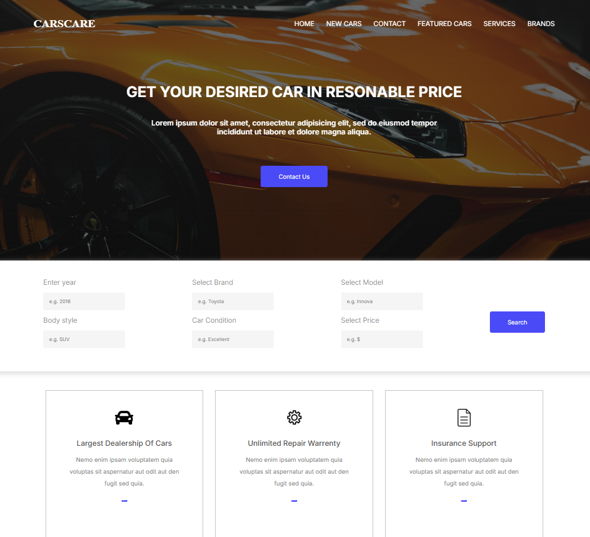
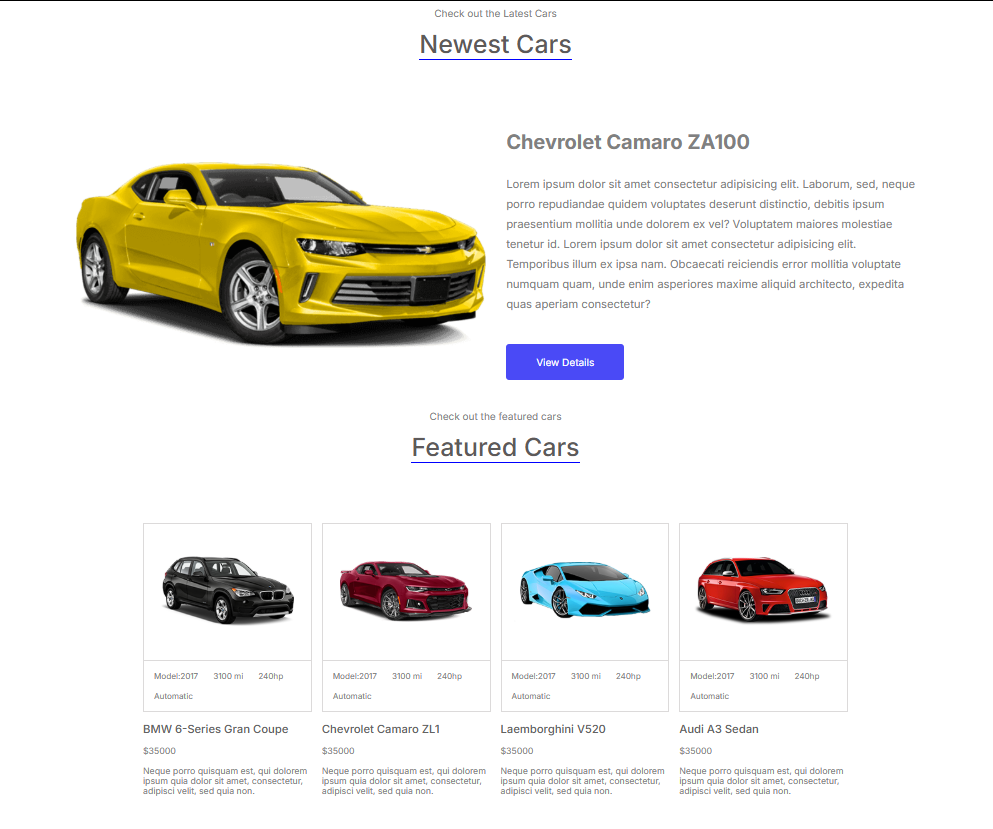
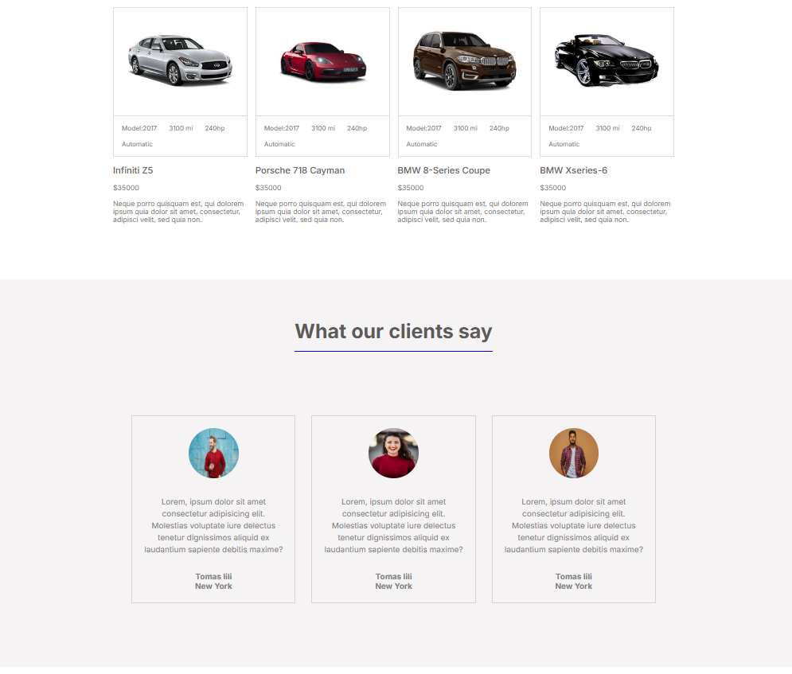
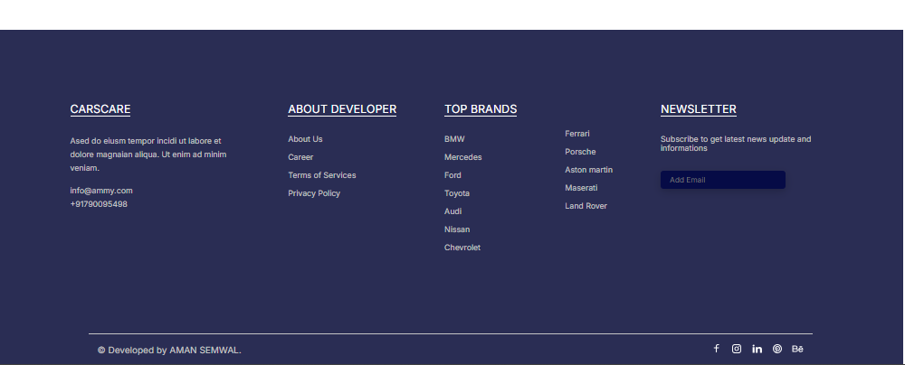
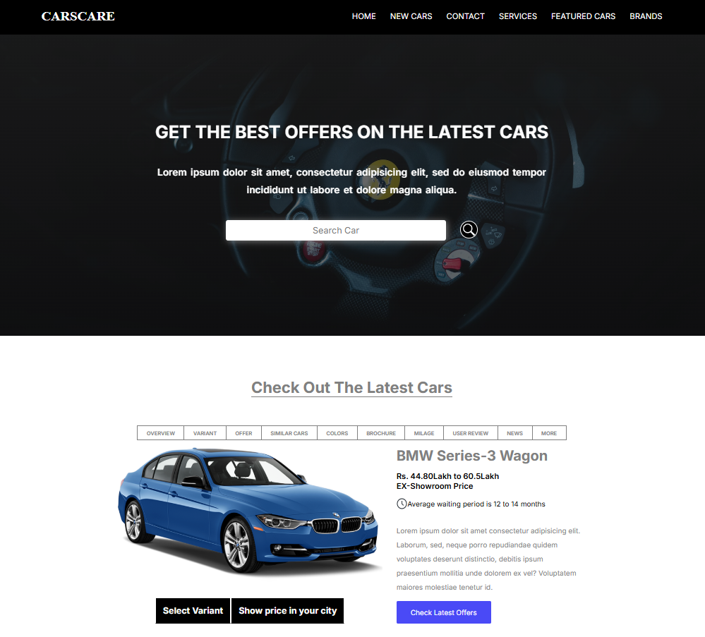
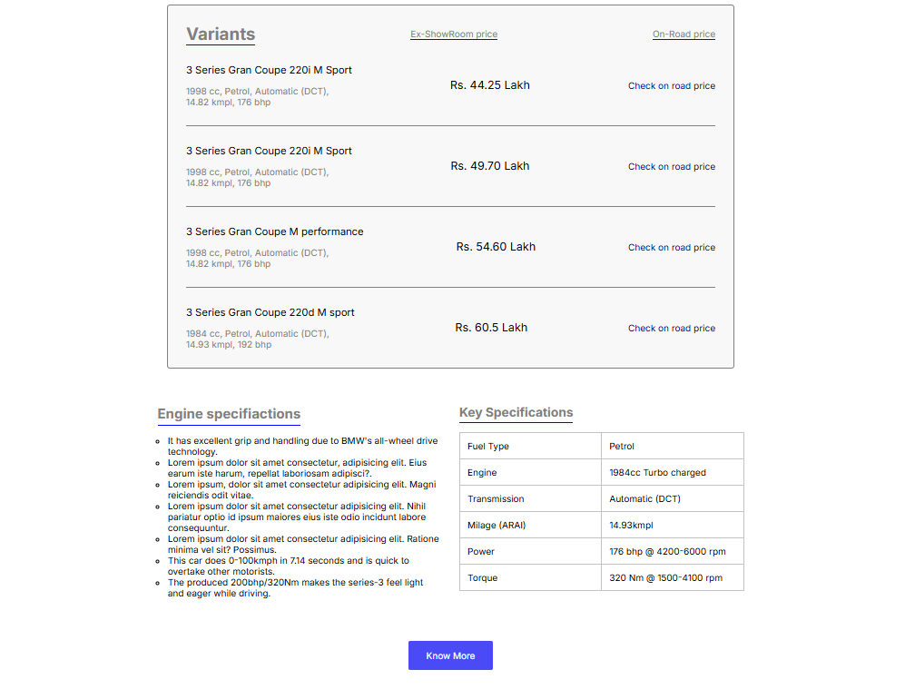
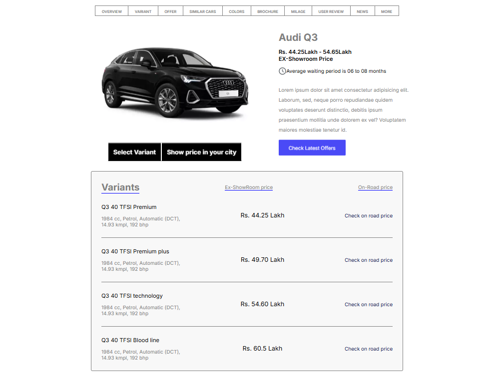
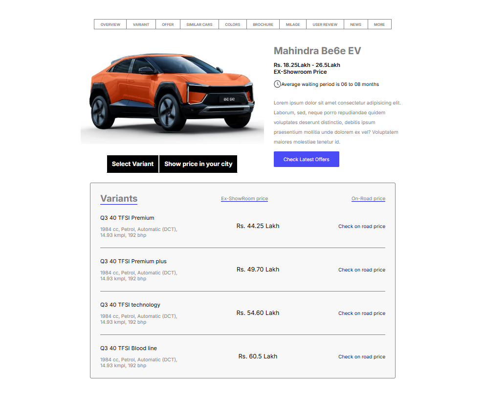
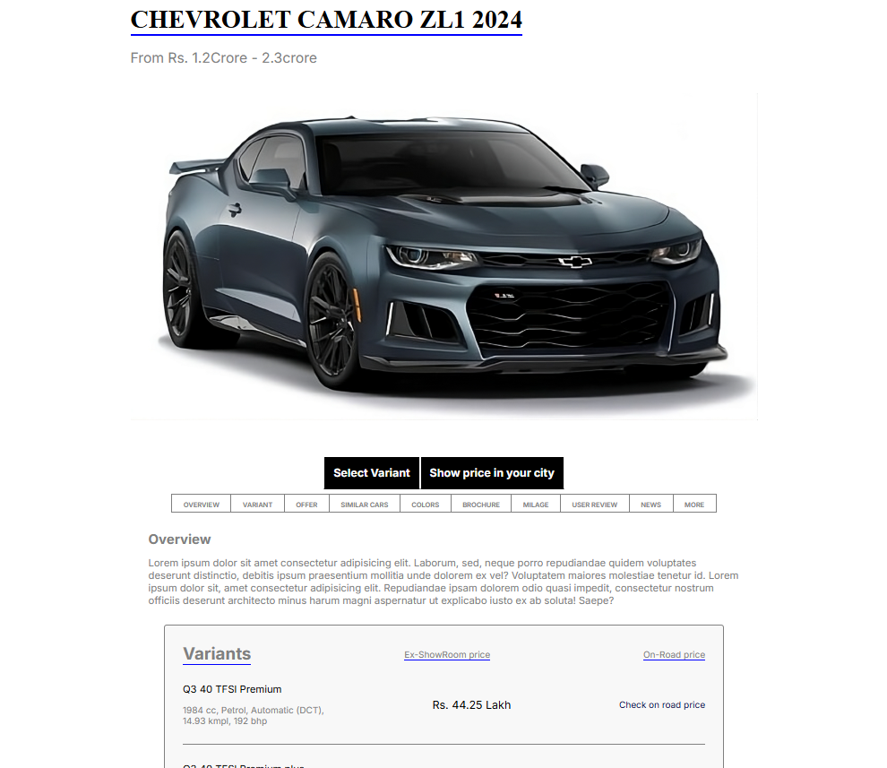

# CarsCare - Car Showcasing Website

## Overview
CarsCare is a responsive car website developed using HTML, CSS and JavaScript. The website showcases car listings, featured vehicles, services, customer testimonials, and contact sections with a modern UI design.

## Features
- Responsive Navigation Bar
- Hero Landing Section
- Featured Cars Section
- Services Section
- Customer Testimonials
- Footer with Brand Information

## Technologies Used
- HTML5
- CSS3
- JavaScript
- Responsive Web Design

## Website Preview

## 2nd page preview

## Author
Aman Semwal
